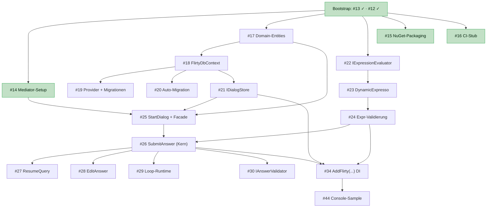

# Flirty – Umsetzungsreihenfolge & Parallelisierung

Diese Datei beschreibt, **in welcher Reihenfolge** die Issues aus [BACKLOG.md](./BACKLOG.md)
abgearbeitet werden sollten und **was parallel** laufen kann. Grundlage sind die technischen
Abhängigkeiten, nicht nur die Backlog-Reihenfolge. Issue-Nummern beziehen sich auf die
GitHub-Issues (#12–#52).

> **Fundament-Status (Bootstrap-Commit `a803b62`, verifiziert):**
> - `#13` Projekt-Skelette + Solution — **erledigt & geschlossen**: 6 Projekte in `Flirty.sln`,
>   Referenzen korrekt (`Flirty` ohne ASP.NET), `dotnet build Flirty.sln` grün.
> - `#12` Repo-Grundgerüst & Konventionen — **erledigt & geschlossen**: Build-Konventionen
>   (`Directory.Build.props`/`.targets`, CS1591=Error) und das CPM-Gerüst stehen, und die
>   **Kern-Package-Versionen (Mediator, EF Core 10 + Provider, DynamicExpresso) sind jetzt zentral
>   gepinnt** in `Directory.Packages.props`. Die Verdrahtung in die Projekte (`<PackageReference>`
>   ohne Version) folgt in den Fach-Issues `#14` / EPIC 1 / EPIC 2.
> - `#15` NuGet-Packaging — **erledigt**: vollständige Metadaten inkl. **MIT-Lizenz**, **Icon**,
>   **SourceLink** und Symbolpaketen (`snupkg`). Versionierung **datumsbasiert** (`JJJJMM.Revision`,
>   z.B. `202604.1`) statt MinVer. `dotnet pack` erzeugt beide `.nupkg` (+ `.snupkg`).
>   Details: [NUGET-PACKAGING.md](./NUGET-PACKAGING.md).
> - `#16` CI-Stub — **erledigt**: GitHub-Actions-Workflow `.github/workflows/ci.yml`
>   (build + test + `dotnet pack` auf `ubuntu-latest`, SDK aus `global.json`) läuft bei Push/PR auf
>   `main` und lädt beide `.nupkg` (+ `.snupkg`) als Artefakt hoch. Der Push zu NuGet ist seit `#49`
>   ein **eigener** Workflow `.github/workflows/release.yml` (manuell, Freigabe-Gate).
>   Details: [CI.md](./CI.md), [NUGET-PACKAGING.md](./NUGET-PACKAGING.md#publizieren-49).
> - `#14` Mediator-Setup im Core — **umgesetzt**: `AddFlirty()`-Stub verdrahtet den Mediator und
>   die Basis-Pipeline-Behaviors (Logging/Validierung); Dummy-Command läuft durch die Pipeline
>   (Tests grün). Siehe [MEDIATOR.md](./MEDIATOR.md).
>
> **Stand EPIC 3:** EPIC 1 (Persistenz, `#17`–`#21`) und EPIC 2 (Expression-Engine, `#22`–`#24`)
> sind erledigt. EPIC 3 – Dialog-Runtime ist **abgeschlossen**: `#25` (StartDialogCommand +
> `IFlirtyEngine`-Facade), `#26` (SubmitAnswerCommand), `#27` (ResumeDialogQuery – Zustand lesen),
> `#28` (EditAnswerCommand – Pfad-Neuberechnung), `#29` (Loop-Runtime – Iterationen/Collections/Break,
> siehe [LOOPS.md](./LOOPS.md)) und `#30` (IAnswerValidator – fachliche Antwort-Validierung, siehe
> [VALIDATION.md](./VALIDATION.md)) sind umgesetzt (siehe [RUNTIME.md](./RUNTIME.md)).

---

## Abhängigkeitsdiagramm (M1 – MVP-Kern)



---

## Reihenfolge in Wellen (M1)

### Welle 1 — sofort startbar (3 unabhängige Stränge)
Nach dem Fundament können diese **parallel** begonnen werden:

| Strang | Start-Issue | Begründung |
|---|---|---|
| **A – Persistenz** | `#17` Domain-Entities + Enums | Wurzel für Runtime, Store und Trigger. Rein im Core. |
| **B – Expression-Engine** | `#22` IExpressionEvaluator + Kontext-Modell | Interface + Kontext-DTO ohne Persistenz baubar. |
| **C – Infra/Enabler** | `#14` Mediator-Setup *(zuerst)*, `#15` Packaging, `#16` CI-Stub | `#14` ist Enabler für die Runtime; `#15`/`#16` völlig entkoppelt. |

### Welle 2 — baut auf Welle 1
- **Strang A:** `#18` FlirtyDbContext (braucht `#17`) → danach **parallel** `#19` Provider/Migrationen · `#20` Auto-Migration · `#21` IDialogStore.
- **Strang B:** `#23` DynamicExpresso-Implementierung → `#24` Expression-Validierung.
- **Früh möglich:** `#31` Notification-Contracts (EPIC 4) — umgesetzt: Contracts **und** Publikation aus den Command-Handlern der Runtime (EPIC 3), siehe [TRIGGERS.md](./TRIGGERS.md).

### Welle 3 — Runtime (Konvergenzpunkt, EPIC 3)
Braucht Domain (`#17`) + Repository (`#21`) + Mediator (`#14`) + Evaluator (`#24`).
1. `#25` StartDialogCommand + Facade *(Einstiegspunkt)*
2. `#26` SubmitAnswerCommand *(zentrales Stück)*
3. danach **parallel**: `#27` ResumeQuery · `#28` EditAnswer · `#30` IAnswerValidator
4. `#29` Loop-Runtime *(baut auf Submit/Transition-Logik)*

### Welle 4 — Integration & M1-Abnahme
- `#34` `AddFlirty(...)`-DI-Extension — bündelt Mediator, Provider, Migrations, Webhook, Evaluator; iterativ, wird am Ende von M1 finalisiert.
- `#44` Console-Single-Project-Sample — End-to-End-Abnahme von M1 (braucht Facade + DI).

---

## Parallelisierung – Kernaussagen

- **Bis zu 3 Personen** können nach dem Fundament gleichzeitig arbeiten: Strang A (Persistenz),
  Strang B (Expression-Engine) und Strang C (Infra/Mediator).
- **Flaschenhals ist EPIC 3 (Runtime):** Hier laufen die Stränge zusammen. `#26 SubmitAnswer`
  ist das zentrale Stück — erst danach lassen sich `#27`/`#28`/`#29`/`#30` gut aufteilen.
- `#15` (Packaging) und `#16` (CI) sind **jederzeit** unabhängig einschiebbar.

## Wenn nur eine Person arbeitet (kritischer Pfad)

```
#14 → #17 → #18 → #22 → #23 → #25 → #26 → (#27 / #28 / #29 / #30) → #34 → #44
```

---

## Folge-Meilensteine (grob)

| Meilenstein | Inhalt | Parallelität |
|---|---|---|
| **M2 – Web & Trigger** | EPIC 4 Rest (`#32`, `#33`; `#31` schon in M1) ∥ EPIC 6 WebAPI (`#35`, `#36`) → Web-Sample `#45` | Trigger- und WebAPI-Strang parallel |
| **M3 – Designer** | EPIC 7 Blazor-Designer (`#37`–`#43`) | baut auf stabiler Core-API + Evaluator auf |
| **M4 – Qualität & Release** | E2E-Tests `#46`/`#47`, Coverage `#48`, NuGet-Publish `#49`, Docs `#50`–`#52` | Test-, Publish- und Doku-Strang parallel |

> **Stand M3: abgeschlossen** – `#37`–`#43` sind umgesetzt (siehe [DESIGNER.md](./DESIGNER.md)).
>
> **Stand M4:** EPIC 9 ist **abgeschlossen** – E2E `#46`/`#47`, Coverage `#48` (siehe
> [CI.md § Coverage](./CI.md#coverage)) und NuGet-Publish `#49` (siehe
> [NUGET-PACKAGING.md § Publizieren](./NUGET-PACKAGING.md#publizieren-49)) sind erledigt. Aus EPIC 10
> sind die `docs/`-Guides `#50` durchgesehen und auf den Stand nach `#43`/`#46`/`#49` gebracht; offen
> bleiben die ADRs `#51` und der Root-README-Ausbau `#52`.

> Innerhalb von M3: `#37` (Connection-Profile) und `#38` (Dialog-CRUD-UI) zuerst, danach sind
> `#39` Frage-Editor, `#40` Branching-Editor, `#41` Loop-Visualisierung und `#42` Trigger-Editor
> weitgehend parallel; `#43` Test-Runner zum Schluss als Integrations-/Abnahme-Feature.
