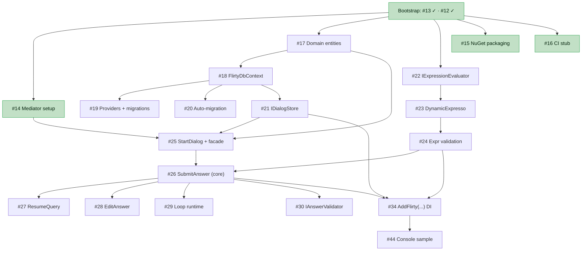

# Flirty – Implementation order & parallelization

This file describes **in which order** the issues from [BACKLOG.md](./BACKLOG.md)
should be worked through and **what can run in parallel**. The basis is the technical
dependencies, not just the backlog order. Issue numbers refer to the
GitHub issues (#12–#52).

> **Foundation status (bootstrap commit `a803b62`, verified):**
> - `#13` project skeletons + solution — **done & closed**: 6 projects in `Flirty.sln`,
>   references correct (`Flirty` without ASP.NET), `dotnet build Flirty.sln` green.
> - `#12` repo scaffold & conventions — **done & closed**: build conventions
>   (`Directory.Build.props`/`.targets`, CS1591=Error) and the CPM scaffold are in place, and the
>   **core package versions (Mediator, EF Core 10 + providers, DynamicExpresso) are now centrally
>   pinned** in `Directory.Packages.props`. Wiring them into the projects (`<PackageReference>`
>   without a version) follows in the feature issues `#14` / EPIC 1 / EPIC 2.
> - `#15` NuGet packaging — **done**: complete metadata incl. **MIT license**, **icon**,
>   **SourceLink** and symbol packages (`snupkg`). Versioning **date-based** (`YYYYMM.Revision`,
>   e.g. `202604.1`) instead of MinVer. `dotnet pack` produces both `.nupkg` (+ `.snupkg`).
>   Details: [NUGET-PACKAGING.md](./NUGET-PACKAGING.md).
> - `#16` CI stub — **done**: GitHub Actions workflow `.github/workflows/ci.yml`
>   (build + test + `dotnet pack` on `ubuntu-latest`, SDK from `global.json`) runs on push/PR to
>   `main` and uploads both `.nupkg` (+ `.snupkg`) as an artifact. The push to NuGet has been a
>   **separate** workflow `.github/workflows/release.yml` since `#49` (manual, approval gate).
>   Details: [CI.md](./CI.md), [NUGET-PACKAGING.md](./NUGET-PACKAGING.md#publishing-49).
> - `#14` Mediator setup in the core — **implemented**: the `AddFlirty()` stub wires the Mediator and
>   the base pipeline behaviors (logging/validation); a dummy command runs through the pipeline
>   (tests green). See [MEDIATOR.md](./MEDIATOR.md).
>
> **Status EPIC 3:** EPIC 1 (persistence, `#17`–`#21`) and EPIC 2 (expression engine, `#22`–`#24`)
> are done. EPIC 3 – dialog runtime is **complete**: `#25` (StartDialogCommand +
> `IFlirtyEngine` facade), `#26` (SubmitAnswerCommand), `#27` (ResumeDialogQuery – read state),
> `#28` (EditAnswerCommand – path recomputation), `#29` (loop runtime – iterations/collections/break,
> see [LOOPS.md](./LOOPS.md)) and `#30` (IAnswerValidator – domain answer validation, see
> [VALIDATION.md](./VALIDATION.md)) are implemented (see [RUNTIME.md](./RUNTIME.md)).

---

## Dependency diagram (M1 – MVP core)


```mermaid
flowchart TD
    F["Bootstrap: #13 ✓ · #12 ✓"]:::done

    F --> E14["#14 Mediator setup"]:::done
    F --> E17["#17 Domain entities"]
    F --> E22["#22 IExpressionEvaluator"]
    F --> E15["#15 NuGet packaging"]:::done
    F --> E16["#16 CI stub"]:::done

    %% Strand A – persistence (EPIC 1)
    E17 --> E18["#18 FlirtyDbContext"]
    E18 --> E19["#19 Providers + migrations"]
    E18 --> E20["#20 Auto-migration"]
    E18 --> E21["#21 IDialogStore"]

    %% Strand B – expression engine (EPIC 2)
    E22 --> E23["#23 DynamicExpresso"]
    E23 --> E24["#24 Expr validation"]

    %% Strand C – runtime (EPIC 3) = convergence point
    E14 --> E25["#25 StartDialog + facade"]
    E17 --> E25
    E21 --> E25
    E25 --> E26["#26 SubmitAnswer (core)"]
    E24 --> E26
    E26 --> E27["#27 ResumeQuery"]
    E26 --> E28["#28 EditAnswer"]
    E26 --> E29["#29 Loop runtime"]
    E26 --> E30["#30 IAnswerValidator"]

    %% Integration / M1 acceptance
    E26 --> E34["#34 AddFlirty(...) DI"]
    E21 --> E34
    E24 --> E34
    E34 --> E44["#44 Console sample"]

    classDef done fill:#c2e0c6,stroke:#2da44e,color:#03210b;
```

---

## Order in waves (M1)

### Wave 1 — startable immediately (3 independent strands)
After the foundation, these can be started **in parallel**:

| Strand | Start issue | Rationale |
|---|---|---|
| **A – persistence** | `#17` domain entities + enums | Root for runtime, store and triggers. Purely in the core. |
| **B – expression engine** | `#22` IExpressionEvaluator + context model | Interface + context DTO can be built without persistence. |
| **C – infra/enablers** | `#14` Mediator setup *(first)*, `#15` packaging, `#16` CI stub | `#14` is the enabler for the runtime; `#15`/`#16` are completely decoupled. |

### Wave 2 — builds on wave 1
- **Strand A:** `#18` FlirtyDbContext (needs `#17`) → then **in parallel** `#19` providers/migrations · `#20` auto-migration · `#21` IDialogStore.
- **Strand B:** `#23` DynamicExpresso implementation → `#24` expression validation.
- **Possible early:** `#31` notification contracts (EPIC 4) — implemented: contracts **and** publication from the command handlers of the runtime (EPIC 3), see [TRIGGERS.md](./TRIGGERS.md).

### Wave 3 — runtime (convergence point, EPIC 3)
Needs the domain (`#17`) + repository (`#21`) + Mediator (`#14`) + evaluator (`#24`).
1. `#25` StartDialogCommand + facade *(entry point)*
2. `#26` SubmitAnswerCommand *(central piece)*
3. then **in parallel**: `#27` ResumeQuery · `#28` EditAnswer · `#30` IAnswerValidator
4. `#29` loop runtime *(builds on the submit/transition logic)*

### Wave 4 — integration & M1 acceptance
- `#34` `AddFlirty(...)` DI extension — bundles Mediator, providers, migrations, webhook, evaluator; iterative, finalized at the end of M1.
- `#44` console single-project sample — end-to-end acceptance of M1 (needs facade + DI).

---

## Parallelization – key points

- **Up to 3 people** can work simultaneously after the foundation: strand A (persistence),
  strand B (expression engine) and strand C (infra/Mediator).
- **The bottleneck is EPIC 3 (runtime):** this is where the strands converge. `#26 SubmitAnswer`
  is the central piece — only after it can `#27`/`#28`/`#29`/`#30` be split up well.
- `#15` (packaging) and `#16` (CI) can be slotted in independently **at any time**.

## When only one person works (critical path)

```
#14 → #17 → #18 → #22 → #23 → #25 → #26 → (#27 / #28 / #29 / #30) → #34 → #44
```

---

## Follow-up milestones (rough)

| Milestone | Content | Parallelism |
|---|---|---|
| **M2 – web & triggers** | EPIC 4 rest (`#32`, `#33`; `#31` already in M1) ∥ EPIC 6 WebAPI (`#35`, `#36`) → web sample `#45` | trigger and WebAPI strands in parallel |
| **M3 – designer** | EPIC 7 Blazor designer (`#37`–`#43`) | builds on a stable core API + evaluator |
| **M4 – quality & release** | E2E tests `#46`/`#47`, coverage `#48`, NuGet publish `#49`, docs `#50`–`#52` | test, publish and docs strands in parallel |
| **M5 – visual graph designer** | EPIC 11 canvas (`#100`–`#105`) | largely sequential, `#104` independent of `#103` |

> **Status M3: complete** – `#37`–`#43` are implemented (see [DESIGNER.md](./DESIGNER.md)).
>
> **Status M4: complete** – EPIC 9 with E2E `#46`/`#47`, coverage `#48` (see
> [CI.md § Coverage](./CI.md#coverage)) and NuGet publish `#49` (see
> [NUGET-PACKAGING.md § Publishing](./NUGET-PACKAGING.md#publishing-49)); EPIC 10 with the
> reviewed `docs/` guides `#50` (status after `#43`/`#46`/`#49`), the ADRs `#51` (four
> decisions, see [docs/adr/](./adr/README.md)) and the root-README build-out `#52` (quickstarts from
> the samples, docs index, package-page rules – see
> [NUGET-PACKAGING.md](./NUGET-PACKAGING.md#the-root-readme-is-the-package-page-52)).

> Within M3: `#37` (connection profiles) and `#38` (dialog CRUD UI) first, then
> `#39` question editor, `#40` branching editor, `#41` loop visualization and `#42` trigger editor
> are largely parallel; `#43` test runner last as an integration/acceptance feature.

> **Status M5: complete** – implemented are `#100` (canvas-technology spike, result
> [ADR 0006](./adr/0006-canvas-technology-in-the-designer.md)), `#101` (read-only graph view, see
> [DESIGNER.md § Graph view](./DESIGNER.md#graph-view-101)), `#102` (layout persistence +
> moving nodes, result [ADR 0007](./adr/0007-layout-as-its-own-table.md)) – with that the
> only schema change of M5 is done –, `#103` (editing on the canvas, result
> [ADR 0008](./adr/0008-gestures-on-the-canvas.md)), `#104` (test run in the graph, see
> [DESIGNER.md § Test run in the graph](./DESIGNER.md#test-run-in-the-graph-104)) and `#105` (Playwright E2E
> of the canvas, see [DESIGNER.md § Tests](./DESIGNER.md#tests)). `#105` closed a gap in the creation flow
> that no unit test could show: the **entry question** could only be set in the dialog editor,
> even though the graph warned about its absence – it can now be set at the node.
>
> Within M5 the chain is largely **sequential**: `#100` decides the technology, `#101`
> builds the layout and drawing model, `#102` brings layout persistence (schema change, its own ADR) and
> `#103` the editing on top of it. Only `#104` (test run in the graph) hangs solely on `#101` and is thus
> independent of `#103`; `#105` (E2E) wraps it up.
